# sei-project-4 - night daze app ⛅️
# Overview
My final project as a Software Engineer Immersive Student at General Assembly was to create a full-stack application with a React front end and Django back end. It was a solo project where I made sure to focus on it being mobile responsive first.

*‘night daze’* is a sky themed social media app where users can upload photos of the sky to share with one another from their devices. Users can register and upload a custom profile image then upload, edit and delete their posts, comment on each other's images and view their own profile to admire their own collection.

*‘night daze’* was inspired by my own love for Instagram, combined with the sky and positivity. As a user, when you register and log in, you get a randomised daily affirmation before viewing the timeline. 

## Find the deployed app here: [night daze](https://night-daze.herokuapp.com/)
I deployed the website using Heroku, which is a free server that sleeps when it is not in use. Please allow it a minute or two to wake up and get going! 💤

To explore please use these credentials to play around the site: 
- Email: panda@email.com
- PW: Django_123

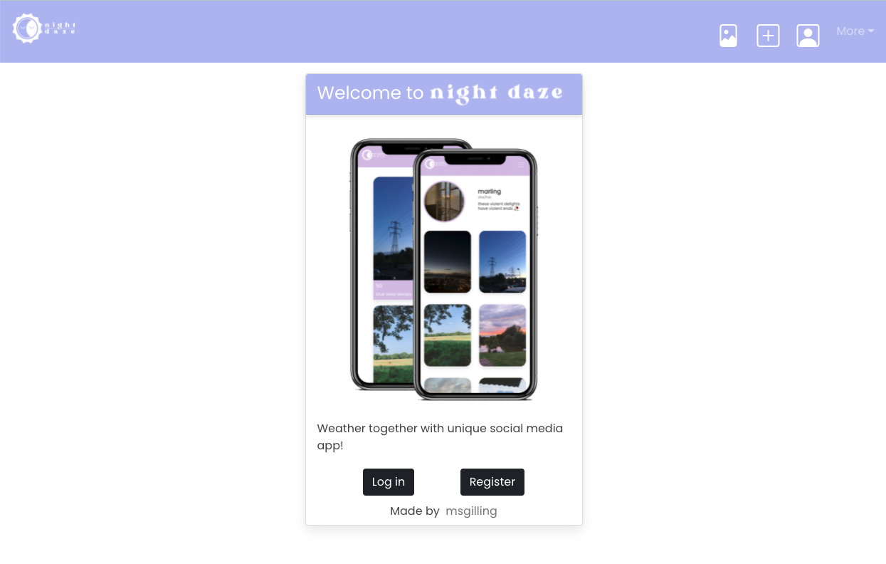

## Brief
To create a full-stack web application using a relational Python, Django and SQL database with a React frontend. The app should contain CRUD functionality and contain several models and relationship types.

#### Timeframe: 8 days

## Technologies
### Backend:
- Python
- Django
- Django REST Framework
- PostgreSQL

### Frontend:
- React.js
- Axios
- React-Bootstrap
- SCSS
- React Router Dom
- Cloudinary

### Development Tools:
- VSCode
- Yarn
- Insomnia
- Trello Board (for planning)
- Google Jamboard (wireframing)
- Google Chrome dev tools
- Git + Github
- Zoom
- Slack

### Other:
- Procreate (for the logo)
- Photoshop (for the home page iPhone image)

## Approach taken
### Planning:
Once I had decided on my project I took my time to plan each stage to ensure I covered all bases and could meet the goals of my MVP. I also knew early on I wanted it to be made mobile responsive first. With this in mind I created a wireframe to help me organise the flow of the app as well as planned the models I needed and the relationships between them.

Relationships:
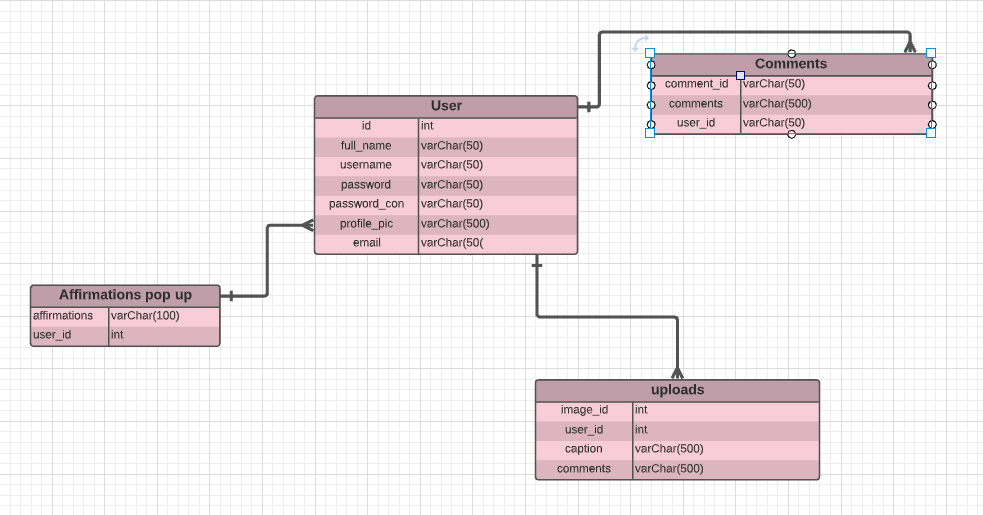

Wireframes:
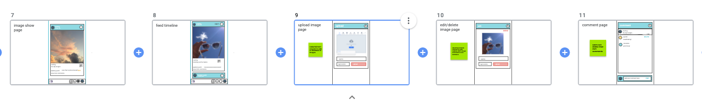

From this information I planned which requests were required from my backend in order to make my MVP possible and decided on the following:

#### GET requests
- /userprofile - so users can view their profile & uploads
- /images - so users can view images on the timeline/individually

#### POST request
- /userprofile - so users can create a profile
- /images - so users can add a new image
- /comments - so users can add comments on images

#### PUT request
- /images - so users can update an image they have uploaded

#### DELETE request
- /images - so users can delete an image they have uploaded
- /comments - so users can delete a comment they have uploaded

Once I had planned that I created a Trello board and added all the tasks I would need to complete my project.

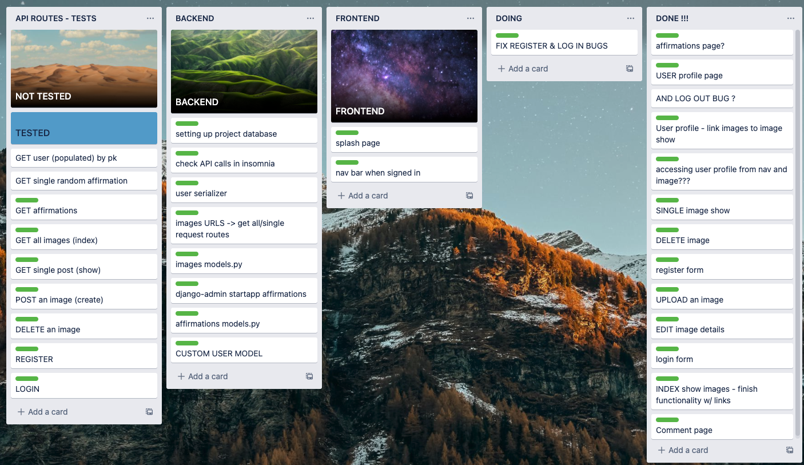

## Backend:
On the backend, I have three models: Images, User and Comments. I created these with the relevant requests and made sure to test each request in Insomnia, making sure all relationships between models worked correctly and in turn receiving the right JSON responses.

Example model:
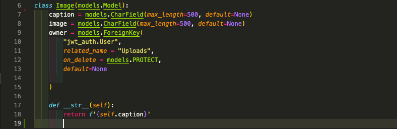

My jwt_auth folder deals with authentication such as register, log in and user model. I built the User model in models.py, using an AbstractUser. This enabled me to add more requirements for my users to fill out such as profile image and pronouns.

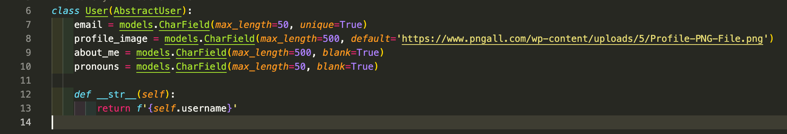

## Frontend:
The Frontend was built using React Hooks. I began building it after building my Backend but did go back to tweak on my Backend when I had issues displaying information on my Frontend. I used Axios for the requests from the back-end, creating an API request library that imported into each specified page. 

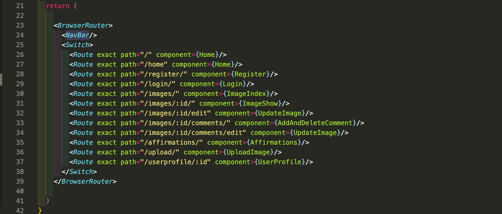

I used react-router-dom for my page navigation in React. I initially started using Bulma, as having previously used it on some other projects but decided to give React-Bootstrap a go as it seemed a lot more lightweight and enabled me to style through CSS quite easily.

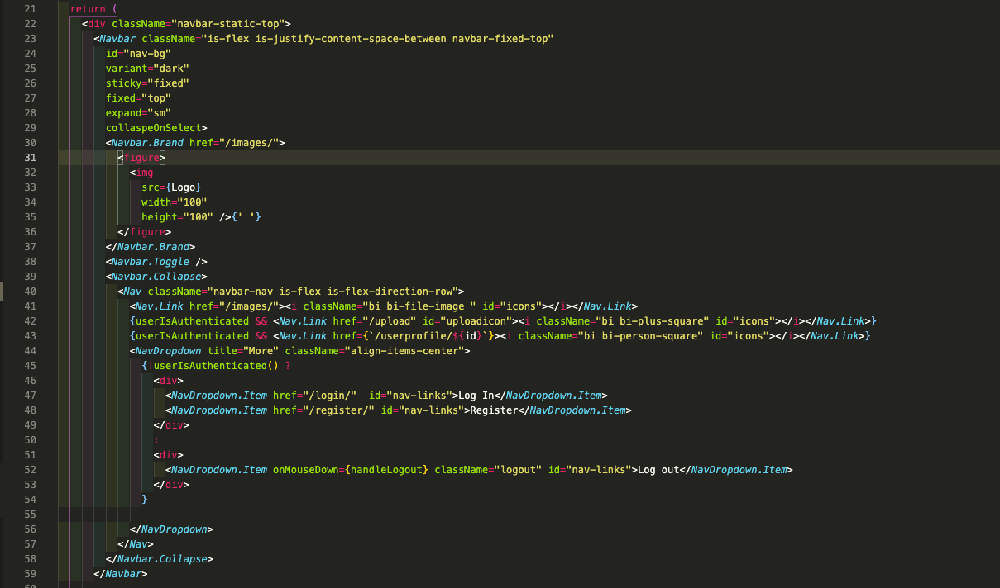

I made sure to style the pages as I created them, to prevent the need to style it and work it all out towards the end of the project. This was a relatively smooth process as I had designed the logo, picked the fonts and thought of the colour palette in the planning stages of the project, knowing I wanted a calming theme.

This was also my first time using Cloudinary and I made a reusable component for the ImageUploadField then imported into my Register and UploadImage files. This was very useful for putting inside my form and reusing the code.

Image Upload Field code:
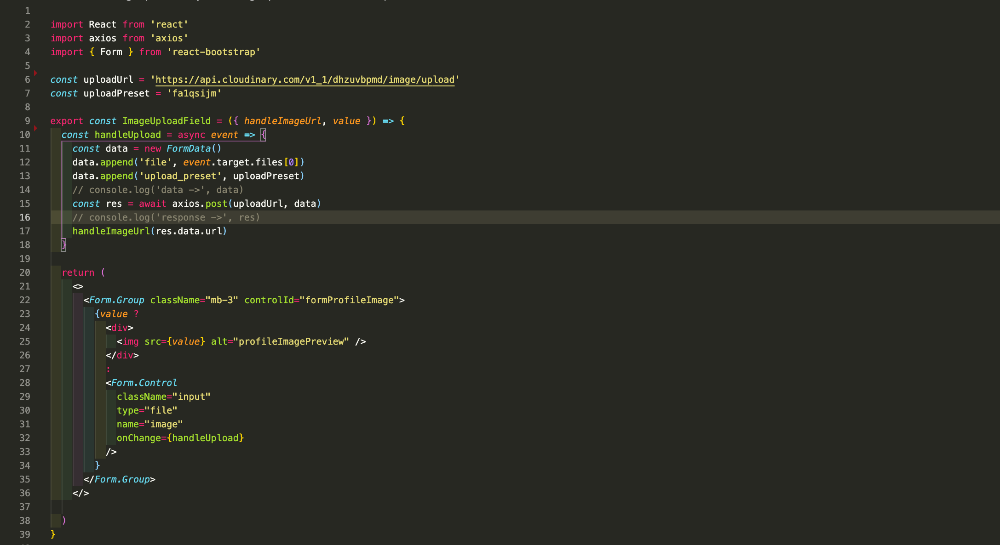

Importing Image Upload Field into Register component:
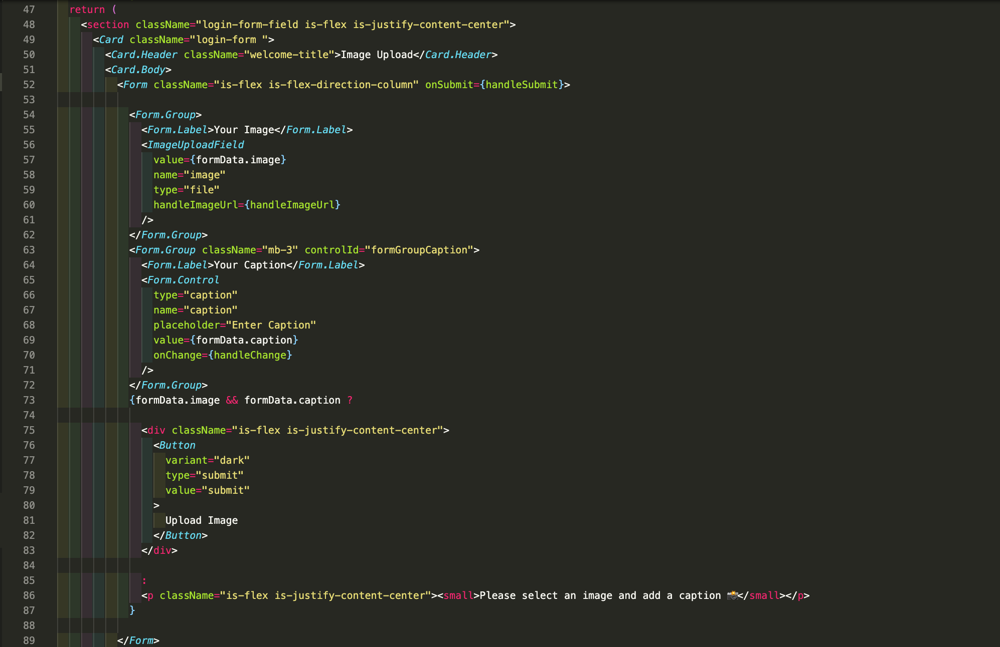

Profile page and affirmations page styling in mobile view:
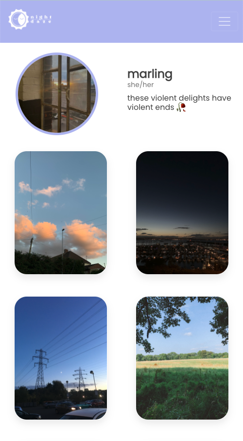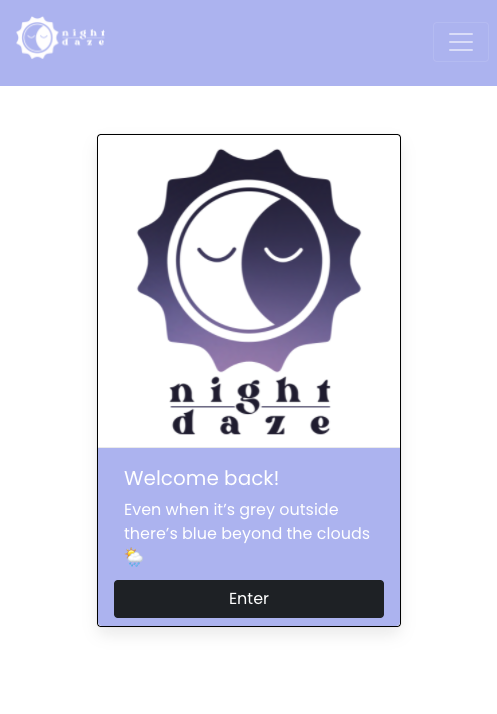

## Bugs
- When registering or logging in, the Network tab in the Google Chrome Dev Tools gives the message “The CSRF token invalid” making users unable to do either. Emptying cookies from the cache fixes this temporarily.
- Error handling on the forms has not been fully built in.
- Navbar does not stay in view when scrolling.

## Challenges 
- This was my first time building a full-stack app independently, so a huge challenge was relying on my own knowledge and problem solving by myself as much as possible.
- We only learned the basics of Python and Django so I found the backend quite difficult to get used to and found when doing stuff on the frontend I realised I didn’t set up the backend how I initially wanted.

## Wins
- I’m really glad I pushed myself to try a new CSS Framework (React-Boostrap) as I found I really enjoyed working with it. I am happy with the styling and glad I took the time to do it as I went along. It’s very simple and I think that helps it look professional yet fun.
- Having a working MVP in the timeframe given.
- Having really detailed notes on Django and Python was really beneficial on setting up, as I wasn’t very used to the process.
- I decided to do our final project solo to test my ability and see how far I’ve come since the start of the course. I’m super happy I was able to build a full-stack app and it has given me tremendous confidence in how far I’ve progressed.

## Key Learnings
- I am really glad that I pushed myself to rise to the challenge to complete a full-stack app by myself as I feel like this project has really helped me gain a much stronger understanding as a developer.
- A big learning experience was managing my workload and I found out very quickly that I had planned unreachable goals for the time frame. I got over excited at building an app all by myself and wanted to implement far too many functionalities. I ended up having to drop a lot of extra goals half way through the project once I realised they were unobtainable in the time frame. I decided not to worry too much about it and focus on the MVP. 

- **Python Fundamentals:** This was my first project using Python where I had the opportunity to develop my skills with it.
- **React.js + React Hooks:** After making three apps with React.js and React Hooks, I have grown in my understanding of its uses and really enjoyed using them. I’m excited to continue to use them in future projects.
- **Django and SQL:** This was my first project using Django in the backend. I initially found it very strict but enjoyed exploring this technology which was so different in comparison to MongoDB and Express.

## Future Features
- The ability to view other users' profiles.
- Adding functionality to like photos and view likes from profile pages.
- Improving responsiveness so it looks just as strong on desktop as it does on mobile.
- To be able to format all images to be uniform that are uploaded.
- Location tags on images to show geographical locations.

